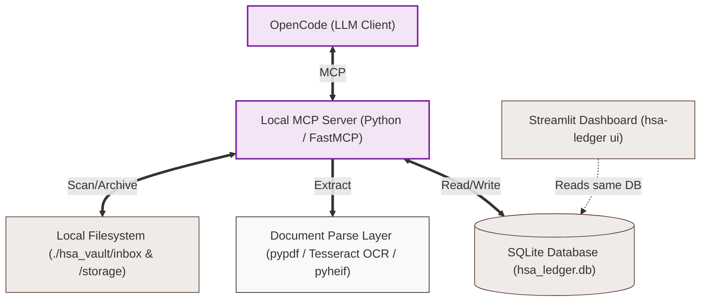

# Functional Specification & Tech Stack: HSA Receipt Ledger

A local-only MCP server + companion CLI for managing Health Savings Account (HSA) receipts, invoices, and Explanation of Benefits (EOBs). LLM-guided extraction with conversational review, backed by a searchable SQLite ledger and a Streamlit dashboard for visual browsing.

---

## 1. Executive Summary & System Architecture

The **HSA Receipt Ledger** is a privacy-first, local-only tool that bridges unstructured document storage (receipts, medical bills, insurance claims) with an LLM acting as a financial auditor. HSA regulations allow taxpayers to claim tax-free distributions years or decades after an expense — this tool maintains a permanent, locally controlled archive.

All document processing, OCR, text indexing, and storage occur strictly within the local filesystem. The system exposes data models and file-handling workflows to an MCP-compliant LLM client (OpenCode), turning the LLM into a guided data-entry assistant with a conversational review step before any record is committed.

### System Topography & Data Flow



### Security Model

- **Zero-cloud.** No data ever leaves the local machine.
- **Filesystem-level protection.** Trusts OS disk encryption and file permissions. No DB-level encryption — avoids passphrase management complexity.
- **Path traversal prevention.** All file operations validated against `INBOX_DIR`/`STORAGE_DIR` boundaries.
- **MCP transport.** Uses stdio transport (OpenCode spawns the server as a subprocess). No network exposure.

---

## 2. Core Operational Workflows

### Workflow A: File Intake, OCR, Classification, and Review

1. **Drop Zone:** Save a receipt photo or PDF into `./hsa_vault/inbox/`. Supported formats: PDF, PNG, JPG, HEIC.
2. **Detection:** Prompt the LLM: *"Process my new medical receipts."* LLM calls `list_untracked_files`.
3. **Extraction:** For each untracked file, LLM calls `extract_file_text`. Server attempts:
   - PDF: digital text extraction via `pypdf`
   - Image (PNG, JPG, HEIC): OCR via `pytesseract`
   - HEIC decoded via `pyheif` before OCR
4. **LLM Analysis & Preview:** LLM receives the raw text, extracts structured fields (provider, date, amount, category, patient), and presents a preview to the user conversationally:

   ```
   Found receipt: receipt_001.jpg
   Provider:      Quest Diagnostics
   Date:          2024-03-15
   Total:         $187.50
   Eligible:      $187.50
   Category:      Lab Work
   Patient:       Self

   This file's SHA-256 hash does not match any existing record.
   Insert this transaction?
   ```

5. **User Confirmation:** User responds yes/no. On yes, LLM calls `insert_hsa_transaction`. On no, file remains in inbox for manual handling.
6. **Duplicate Handling:** If the file's SHA-256 hash matches an existing record, `insert_hsa_transaction` returns a conflict message. LLM presents to user:

   ```
   This file is a duplicate of:
     Receipt #abc123 — Quest Diagnostics, 2024-03-15, $187.50
   Process anyway (re-insert) or skip?
   ```

   User decides. Re-insertion is allowed (e.g., same receipt, different reimbursement event).

7. **Ingestion:** On confirmed insert, server stores the record, generates the ID, and moves the file from inbox to `./hsa_vault/storage/<id>_<original_name>`.

### Workflow B: Audit, Verification, and Reconciliation

1. **Natural Language Query:** Prompt: *"Find my out-of-pocket dental costs from last year so I can request an HSA distribution."*
2. **Contextual Processing:** LLM extracts parameters (date range, category, reimbursement status) and calls `search_ledger`.
3. **Result Presentation:** LLM displays matches with file paths. User can open files directly from the local path.
4. **Reimbursement Tracking:** When funds are drawn from the HSA, prompt: *"Mark receipt abc123 as reimbursed as of today."* LLM calls `update_reimbursement_status`.

### Workflow C: Visual Browsing (Companion Dashboard)

1. Run `hsa-ledger ui` in the project directory.
2. Streamlit launches a local web app at `http://localhost:8501`.
3. Dashboard shows filterable tables, category breakdown charts, reimbursement status, and links to archived files.

---

## 3. Database Schema (`hsa_ledger.db`)

```sql
CREATE TABLE IF NOT EXISTS hsa_receipts (
    id TEXT PRIMARY KEY,                 -- SHA-256 hash of the original file
    file_path TEXT NOT NULL,             -- Relative path in storage (e.g., "storage/{id}_{name}")
    file_name TEXT NOT NULL,             -- Original file name
    provider TEXT NOT NULL,              -- Healthcare provider, facility, or pharmacy
    patient_name TEXT,                   -- "Self", "Spouse", "Child A", etc.
    transaction_date TEXT NOT NULL,      -- ISO-8601 (YYYY-MM-DD)
    total_amount REAL NOT NULL,          -- Total invoice amount
    hsa_eligible_amount REAL NOT NULL,   -- Tax-qualified portion
    category TEXT,                       -- "Dental", "Vision", "Prescription", "Inpatient", "Lab Work", etc.
    is_reimbursed INTEGER DEFAULT 0,     -- 0 = banked, 1 = reimbursed
    reimbursement_date TEXT,             -- YYYY-MM-DD
    extracted_text TEXT,                 -- Raw OCR/text dump for full-text search
    created_at TEXT DEFAULT CURRENT_TIMESTAMP
);
```

---

## 4. MCP Tool Specification

| Tool                          | Parameters                                                                               | Action                                                                                                                                                            | Response                                                             |
| ----------------------------- | ---------------------------------------------------------------------------------------- | ----------------------------------------------------------------------------------------------------------------------------------------------------------------- | -------------------------------------------------------------------- |
| `list_untracked_files`        | `None`                                                                                   | Scans inbox, cross-references filenames against DB                                                                                                                | Array of untracked filenames                                         |
| `extract_file_text`           | `{"file_name": "string"}`                                                                | Extracts text from file in inbox. For PDF: pypdf. For images: decode HEIC if needed, then Tesseract OCR                                                           | Unstructured text string, or error message                           |
| `insert_hsa_transaction`      | All DB columns (except `id`, `created_at`) plus `force`                                              | Computes SHA-256 hash of file. If hash exists in DB, returns conflict with existing record details. If not (or force=True), inserts row and moves file to storage | Confirmation with new ID, or conflict message with duplicate details |
| `search_ledger`               | `{"query": "", "start_date": "", "end_date": "", "category": "", "is_reimbursed": null}` | Filtered SQL query                                                                                                                                                | JSON array of matching records with file paths                       |
| `update_reimbursement_status` | `{"id": "string", "is_reimbursed": 1, "date": "2025-01-15"}`                             | Updates the reimbursement flag and date                                                                                                                           | Success/failure confirmation                                         |

---

## 5. CLI Specification (`hsa-ledger`)

A Python CLI installed via pip. Implemented with `click`.

### Commands

| Command                      | Description                                                                                                                                                             |
| ---------------------------- | ----------------------------------------------------------------------------------------------------------------------------------------------------------------------- |
| `hsa-ledger init`            | Creates `./hsa_vault/` directory structure (inbox, storage) and initializes the SQLite DB with the schema. Idempotent. Supports `--vault` and `--db` flags.              |
| `hsa-ledger ui`              | Launches the Streamlit dashboard. Reads the existing `hsa_ledger.db`. Supports `--vault` and `--db` flags.                                                              |
| `hsa-ledger status`          | Shows vault stats: total records, unreimbursed total, inbox file count. Supports `--vault` and `--db` flags.                                                            |
| `hsa-ledger clear --dry-run` | Dry-run mode: shows what would be deleted (count of records, count of storage files) without making changes.                                                            |
| `hsa-ledger clear --force`   | Destructive. Deletes all DB records. Moves files from `./hsa_vault/storage/` to `./hsa_vault/archive/<YYYY-MM-DD>/` (timestamped subdirectory). Leaves inbox untouched. |
| `hsa-ledger export --csv`    | Exports ledger to CSV (for backup or spreadsheet analysis). Supports `--vault` and `--db` flags.                                                                        |

### OpenCode MCP Integration

The user registers the server in their `opencode.jsonc`:

```jsonc
{
  "mcpServers": {
    "hsa-receipt-ledger": {
      "command": "hsa-ledger",
      "args": ["mcp"]
    }
  }
}
```

`hsa-ledger mcp` runs the FastMCP server over stdio.

---

## 6. Testing

### Framework

- **`pytest`** with `pytest-mock` for mock-based unit tests
- **`uv`** for package management and test execution (`uv run pytest`)

### Test Structure

```
tests/
├── conftest.py              # Fixtures: temp vault dir, empty DB, sample files
├── test_database.py         # DB init, schema creation, CRUD
├── test_vault.py            # File scan, move, archive operations
├── test_extractor.py        # PDF text extraction, image OCR, HEIC decode
├── test_server.py           # MCP tool logic (insert with dup check, search, etc.)
├── test_cli.py              # CLI commands (init, status, clear, ui, export)
└── fixtures/                # Placeholder for future real fixture files
```

### What to Test

| Layer                  | Tests                                                                                                                                                                   |
| ---------------------- | ----------------------------------------------------------------------------------------------------------------------------------------------------------------------- |
| **Database**           | Schema creation is idempotent. Insert, query, update, delete. `search_ledger` filter combinations.                                                                      |
| **Vault**              | `list_untracked_files` excludes tracked files. File move from inbox to storage. Archive creates timestamped subdirectory. Dry-run mode does not move files.             |
| **Extractor**          | PDF text layer extraction. Image OCR returns expected text. HEIC decode + OCR. Path traversal prevention. Missing file returns error (not exception).                   |
| **Server (MCP tools)** | `insert_hsa_transaction` computes SHA-256 correctly. Duplicate hash returns conflict message; `force=True` overrides. `update_reimbursement_status` validates inputs.   |
| **CLI**                | `init` creates vault dirs and DB. `status` prints correct counts. `clear --dry-run` shows preview, `clear --force` archives and wipes. `export --csv` writes valid CSV. |

### Mock Strategy

- `pypdf.PdfReader` — mock file reads for PDF tests (no real PDF needed)
- `pytesseract.image_to_string` — mock OCR output
- `pyheif.read_heif` — mock HEIC decode
- Filesystem operations use `tmp_path` fixture (built-in pytest)

### Coverage Target

- Minimum 85% line coverage
- All error paths tested (missing file, corrupt file, hash collision, path traversal attempt)

---

## 7. Companion Dashboard (`hsa-ledger ui`)

### Tech

- **Streamlit** — minimal Python web framework, reads the same SQLite DB directly.
- Ships as a project dependency (no separate install).

### Screens / Features

| Screen                    | Content                                                                   |
| ------------------------- | ------------------------------------------------------------------------- |
| **Transactions table**    | All records in a sortable, filterable DataTable. Columns match DB schema. |
| **Category breakdown**    | Bar chart of total/eligible amounts by category.                          |
| **Reimbursement tracker** | Side-by-side: total banked vs. total reimbursed.                          |
| **Search**                | Full-text search across provider, category, extracted_text.               |
| **Inbox watcher**         | Shows files in inbox not yet processed.                                   |

Launch: `hsa-ledger ui` opens `http://localhost:8501`.

---

## 8. Tech Stack

| Layer         | Technology                        |
| ------------- | --------------------------------- |
| Runtime       | Python 3.11+                      |
| MCP Framework | FastMCP (official Python MCP SDK) |
| PDF Text      | `pypdf`                           |
| OCR Engine    | `pytesseract` (Tesseract)         |
| HEIC Decode   | `pyheif`                          |
| Database      | SQLite (stdlib `sqlite3`)         |
| CLI           | `click`                         |
| Dashboard     | `streamlit` + `pandas`            |
| Hashing       | `hashlib.sha256` (stdlib)         |

---

## 9. Prototype Blueprint

### File structure

```
hsa-receipt-ledger/
├── .gitignore
├── AGENTS.md
├── README.md
├── pyproject.toml
├── uv.lock
├── src/
│   └── hsa_ledger/
│       ├── __init__.py
│       ├── __main__.py          # CLI entry point (click)
│       ├── server.py            # 5 MCP tool definitions (FastMCP)
│       ├── database.py          # DB init, CRUD, search, stats
│       ├── extractor.py         # PDF / image / HEIC text extraction
│       ├── vault.py             # Filesystem operations (scan, move, archive)
│       └── ui.py                # Streamlit dashboard
├── tests/
│   ├── conftest.py
│   ├── test_database.py
│   ├── test_vault.py
│   ├── test_extractor.py
│   ├── test_server.py
│   ├── test_cli.py
│   └── fixtures/
├── hsa_vault/
│   ├── inbox/
│   ├── storage/
│   └── archive/
├── docs/
│   └── specs.md
```

### Server Tool Signatures

```python
# server.py
import json, os, hashlib
from mcp.server.fastmcp import FastMCP

mcp = FastMCP("HSA-Receipt-Ledger")

def _validate_basename(name: str) -> None:
    if "/" in name or "\\" in name or name.startswith("."):
        raise ValueError(f"Invalid file name: {name}")

@mcp.tool()
def list_untracked_files() -> list[str]:
    """Scan inbox for files not yet in database."""

@mcp.tool()
def extract_file_text(file_name: str) -> str:
    """Extract text from PDF, image, or HEIC in inbox. Returns text or error."""

@mcp.tool()
def insert_hsa_transaction(
    file_name: str,
    provider: str,
    patient_name: str = None,
    transaction_date: str = None,
    total_amount: float = None,
    hsa_eligible_amount: float = None,
    category: str = None,
    extracted_text: str = None,
    force: bool = False,
) -> str:
    """Insert a transaction after user confirms. SHA-256 dup detection.
    Conflict if hash exists and force=False; overrides if force=True."""

@mcp.tool()
def search_ledger(query="", start_date="", end_date="", category="",
                  is_reimbursed=None) -> str:
    """Search ledger with optional filters. Returns JSON array."""

@mcp.tool()
def update_reimbursement_status(id: str, is_reimbursed: int, date: str = None) -> str:
    """Mark a receipt as reimbursed (or undo it)."""
```

### CLI Entry Point

```python
# __main__.py — click-based CLI
@click.group()
def cli(): pass

@cli.command()
def init(vault, db): ...
@cli.command()
def status(vault, db): ...
@cli.command()
def clear(dry_run, force, vault, db): ...
@cli.command()
def export(csv_path, vault, db): ...
@cli.command()
def ui(vault, db): ...

def run_mcp():
    init_server(vault, db)
    mcp.run()

def main():
    if len(sys.argv) > 1 and sys.argv[1] == "mcp":
        run_mcp()
    else:
        cli()
```

---

## 10. Future Considerations (Explicitly Out of Scope for v1)

- Local LLM integration
- Database encryption (trusts OS-level disk encryption)
- Batch receipt processing without per-item review
